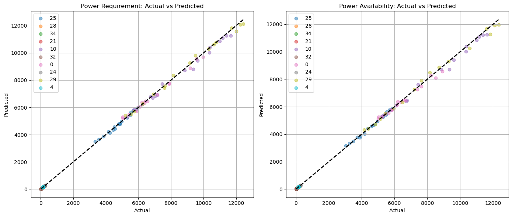

# State wise Annual Energy Forecast for India
This repository holds a Flask app and a random forest model that takes in state, year, population. It serves as <b>backend</b>. Also find command used to build Docker image and deploy as a web service on render.

The backend is live at URL='https://forecast-india-statewise-energy-backend.onrender.com/predict'. Hit it while provoding a json containing 3 fields, e.g.:

```json
{ "State/Union Territory": "West Bengal", "End_Year": 2024, "population(crores)": 9.97 }
```
output:

```json
{ "avail_crore_kWh": 6720.77, "req_crore_kWh": 7481.98 }
```
# How good are the predictions?

Here we make our regressor predict for 10 random states (each index refer to a particular state/union territory)
and we plot the predicted values against what given in the data we used to train.

<div align="center">
  
</div>

The model have a mean absolute percentage error < 3% for both power availability and requirement in kWh. 

## Evaluation Results

| Metric | Power Requirement | Availability of Power |
|--------|-------------------|-----------------------|
| MAE%   | 2.12              | 2.20                  |
| RMSE%  | 4.52              | 4.51                  |
| MAPE   | 2.78              | 2.82                  |

# What is the data we used to train and test our Random Forest Model?

1. India Power Infrastructure Data (2004-2021) Statewise Power Infrastructure Data by RBI,

Refer here: https://www.kaggle.com/datasets/hangryjay/india-power-infrastructure-data

We did the usual data imputations for missing, outliers, wrong values etc, find "India_Infras_Processed.csv" in appendices.

# Try our interface here: https://forecast-india-statewise-energy.onrender.com/
to get predictions

The codebase for stream lit (frontend) user interface : 
https://github.com/pranoyghosh35/forecast_india_statewise_energy_streamlit_frontend.git 

# Feel free to distribute,include and reuse but give credits!!

